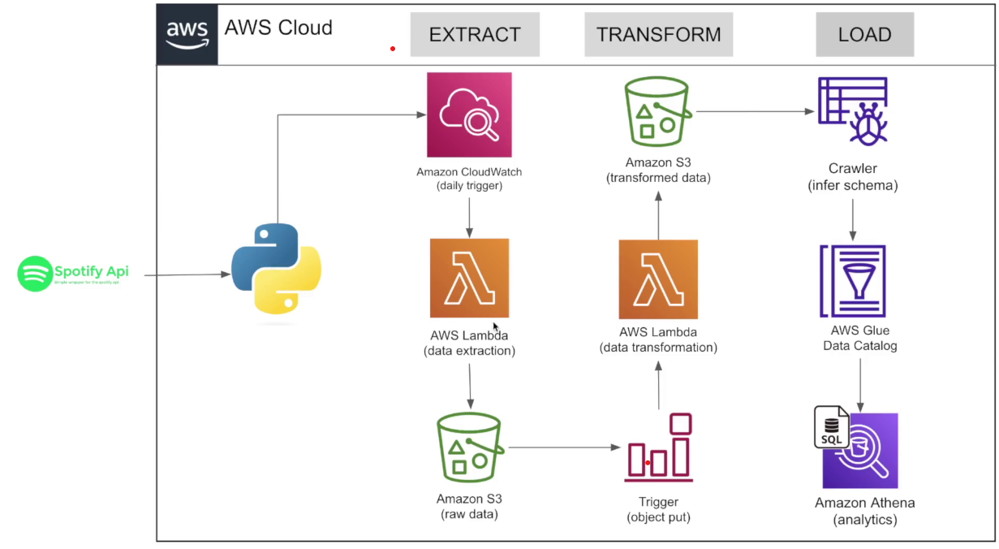

# Spotify-Data-Pipeline-with-AWS

This project extracts, transforms, and loads Spotify playlist data into AWS using a serverless architecture with AWS Lambda, Amazon S3, AWS Glue, and Amazon Athena. It showcases a full ETL pipeline built with Python, Spotipy (Spotify API), and AWS services.

## Architecture Diagram



## Overview

- **Source**: Spotify API  
- **Destination**: Amazon S3, AWS Glue Catalog, Amazon Athena  
- **Trigger**: AWS CloudWatch (daily)  
- **Processing**: AWS Lambda (Python functions)  
- **Data Output**: CSVs for Albums, Artists, and Songs  

## ETL

### 1. Extract

- CloudWatch Event Rule triggers the Lambda function daily.  
- Lambda Function (Extraction): `spotify_api_data_extract.py`  
- Authenticates with the Spotify API using Spotipy.  
- Downloads playlist data and stores it as JSON in an S3 bucket under `raw_data/to_processed/`.

### 2. Transform

- Trigger: S3 object creation triggers another Lambda function.  
- Lambda Function (Transformation): `spotify_data_transformation.py`  
- Reads raw JSON files from S3.  
- Extracts and transforms structured albums, artists, and songs data.  
- Stores transformed data as CSV files in:
  - `transformed_data/album_data/`
  - `transformed_data/artist_data/`
  - `transformed_data/songs_data/`  
- Moves processed raw data to `raw_data/processed/`.

### 3. Load

- **AWS Glue Crawler**:  
  - Crawls the `transformed_data/` folders.
  - Infers schema and updates the Glue Data Catalog.

- **AWS Glue Data Catalog**:  
  - Creates structured tables from the transformed CSVs:
    - `album_data`
    - `artist_data`
    - `songs_data`

- **Amazon Athena**:  
  - Runs SQL queries on the structured datasets for analytics.
  - Example:
    ```sql
    SELECT artist_name, COUNT(*) AS song_count
    FROM songs_data
    GROUP BY artist_name
    ORDER BY song_count DESC
    LIMIT 10;
    ```

